# Project Title: Active Directory Homelab hands-on practice

## 📌 Objective
Build a virtualized Windows Domain Environment to practice the fundamentals of System administration and cybersecurity.

---

## 🖥️ Environment
- Windows Server 2025 (Domain Controller)
- Windows 11 (Client Computer)
- Hyper-V
- Active Directory, Group Policy
  
---

## 🏗️ Lab Architecture

---

## ⚙️ Implementation Summary
- Installed and Configure both Virtual Machine for Client(Windows 11) and Server(Windows Server 2025)
- Install Active Directory Domain Services.
- Promote Server to Domain Controller
- Create Organizational units and Users
- Joined a Client PC into Domain
- Applied Group Policies
---

## 📸 Screenshots and Steps
Below are the documented screenshots of Active Directory, Configurations, Security Practices. Each of these images are explained and also labeled for clarity.
### Step:1 Hyper-V and Virtual Machines Setup

- Set up the lab environment by creating two virtual machines (Server and Client).
- Allocated the systen resources and ready both of the virtual machine for installation.
  

- Configured an external virtual switch in Hyper-V that will connect both VMs into the same network.

- Ensured that both VMs are connected into the same switch for a proper communication between server and client.
---
### Step:2 Windows Server installation and configuration

- Set a strong password for local Administrator.

- Installed Windows Server 2025 on the server VM.

- Renamed the server into DC01 for better identification.

- Configured a static IP address on the Windows Server to ensure stable network identity.
- Temporarily assigned the router’s DNS server so the system could access the internet for updates and feature installation.

- Verified connectivity before installing Active Directory Domain Services.

### Step:2.1 Installing Active Directory Domain Services

- Selected the role Active Directory Domain Services.

- Successfully installed ADDS into the server.

### Step:2.2 Promoting the server to Domain Controller

- Promoted the server to a Domain Controller and created a new forest named **adlab.local**.

- Configured the server to install and integrate DNS services with Active Directory.

- Set the domain and NetBIOS name for the Active Directory environment.

- Completed the prerequisites check and verified system readiness before finalizing the promotion.
- The DNS delegation warning appeared because this is a new forest with no existing parent DNS zone. This is expected behavior and does not affect functionality.

### Step 2.3: Post-Installation Verification and DNS Reconfiguration

- Verified successful installation and promotion of the server by confirming that Active Directory Domain Services and DNS are both running with healthy status in Server Manager.

- Reconfigured the server’s DNS settings to point to its own IP address.
- This ensures the Domain Controller uses itself as the primary DNS server, which is required for proper Active Directory functionality and domain name resolution.

- Tested DNS functionality by resolving the domain name to confirm proper name resolution.
---
### Step 3: Creating Organizational Units (OUs) separated by Department

- Created an OU for Admins it separated from the other departments.
- Admins OU is separate for privileged accounts.
- Checked the **"Protect from accidental deletion"** to prevent it from deleting accidentally.

- Created each departments OUs: HR, IT, and Finance.
- Each department contains Users and Computers sub-OUs for better organization and security management.

### Step 3.1: Creating User for the User OU

- Create a User for the IT Department.

- Filled up the users information for their user account.

- Created a strong password for the User.
- Temporarily disabled **"User must change password at next logon"** for lab purposes(It's not recommended).

- This image shows that the user is successfully created.
---
### Step 4: Set up client computer and join it into domain
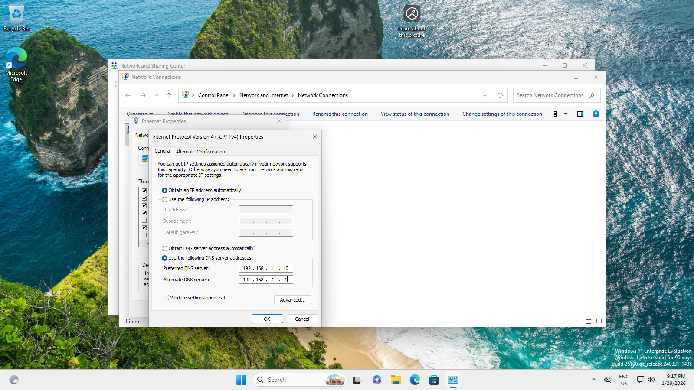
- Installed Windows 11 client and configured its DNS to point to the Domain Controller’s IP address in preparation for domain joining.

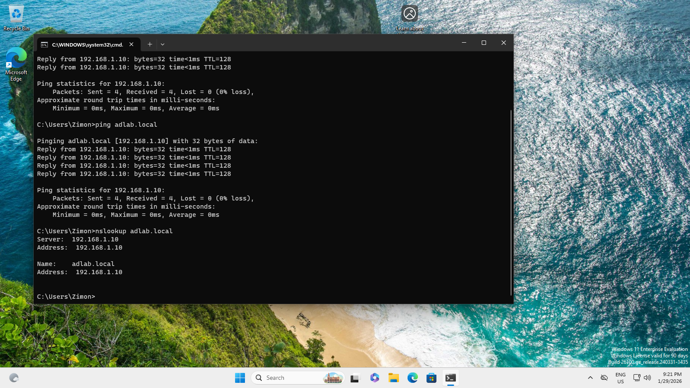
- Verified DNS communication between the client and the Domain Controller.

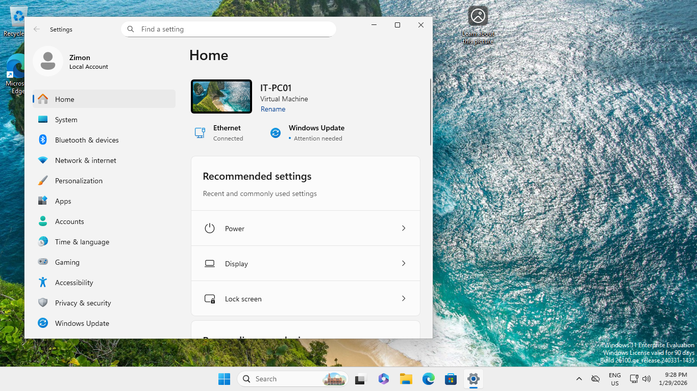
- Renamed the client computer for proper identification before joining the domain.

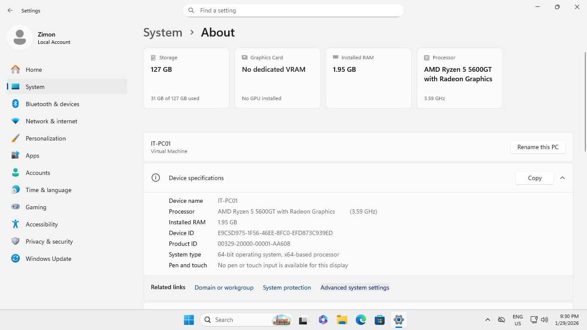
- Navigated to the Settings>System>About>Advance System Settings.

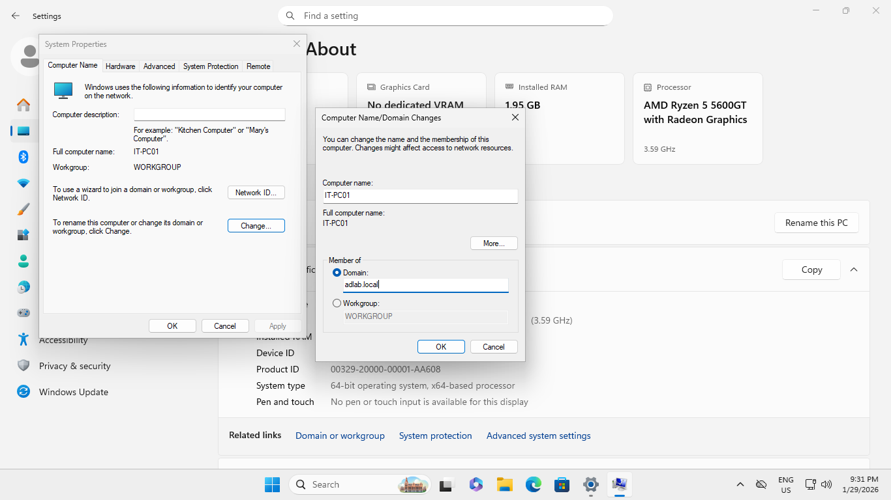
- Selected the Domain option and entered the domain name adlab.local.

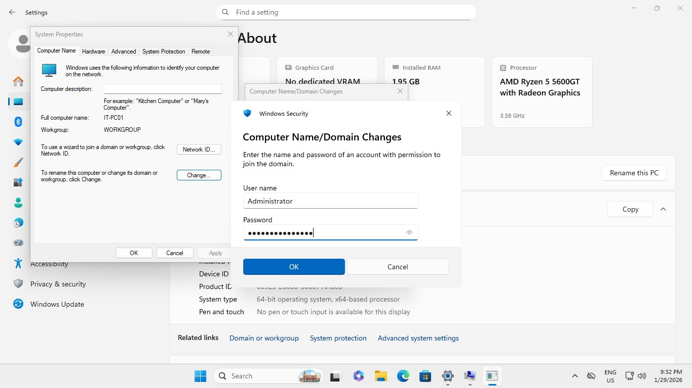
- Entered credentials of an account authorized to join computers to the domain.
- (For this lab, the built-in Administrator account was used. In production environments, a delegated account is recommended.)

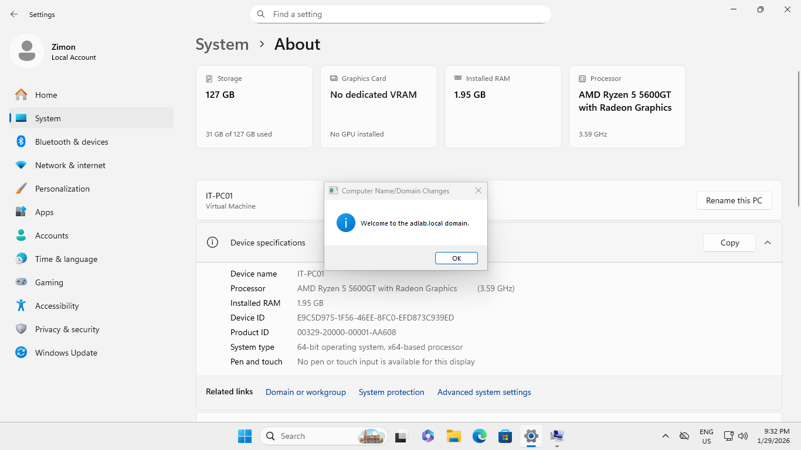
- The client computer was successfully joined to the domain.

### Step 4.1: Domain user logon test and troubleshooting
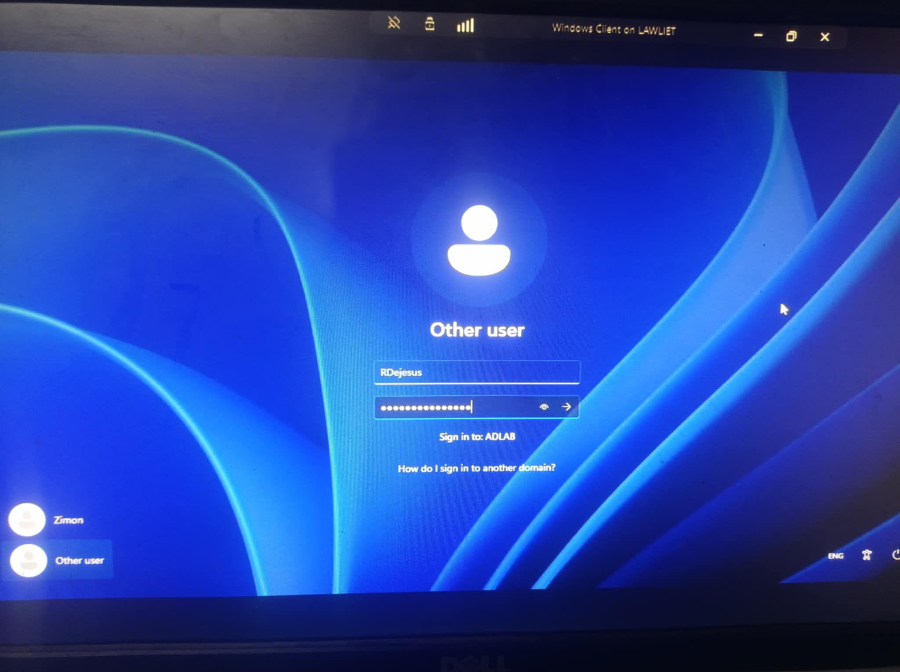
- Attempted to log in using the domain user created in Step 3.1.

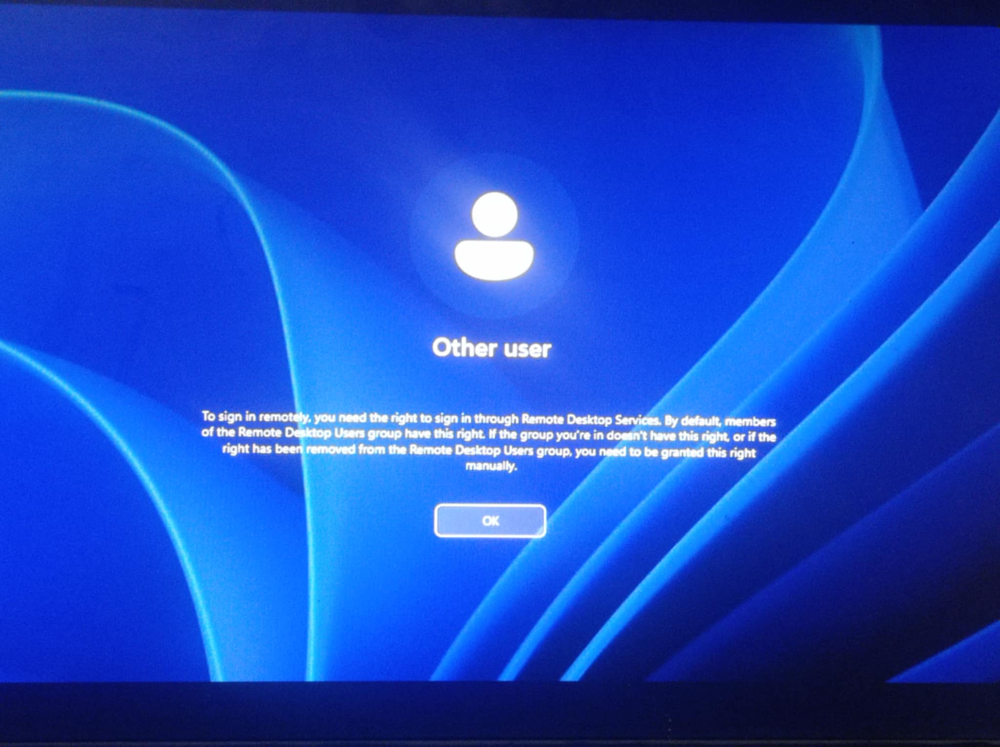
- The login failed with a Remote Desktop Services-related error due to missing user logon rights.

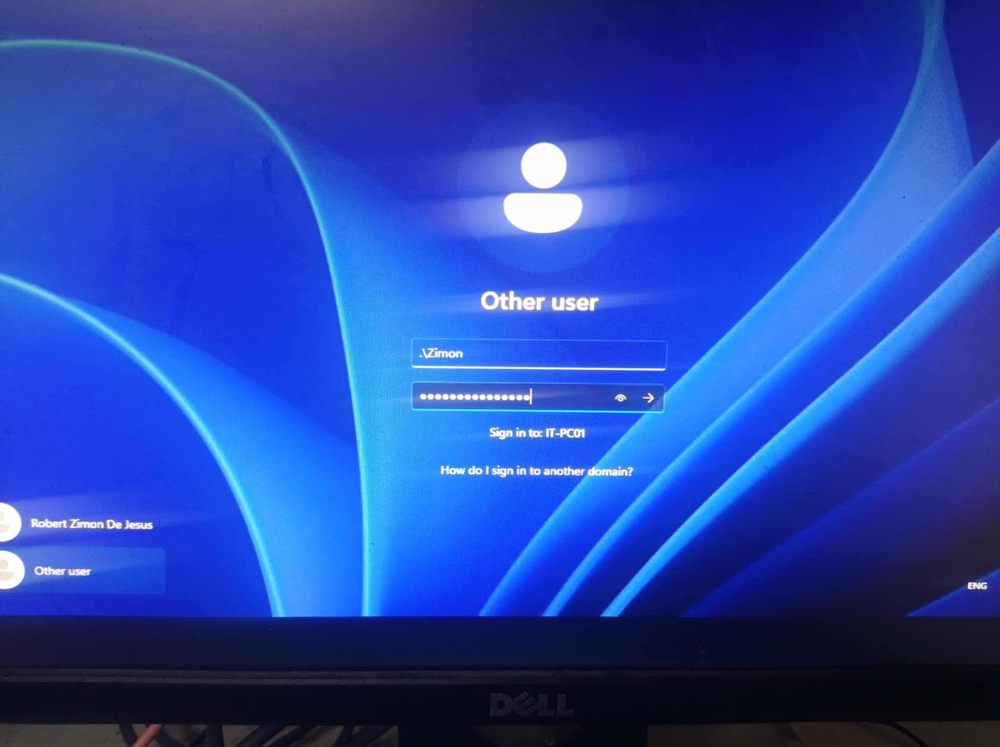
- To fix the issue I logged-in in the client using either Local Administrator or the Domains Administrator account in this picture I logged-in as a Local Administrator.

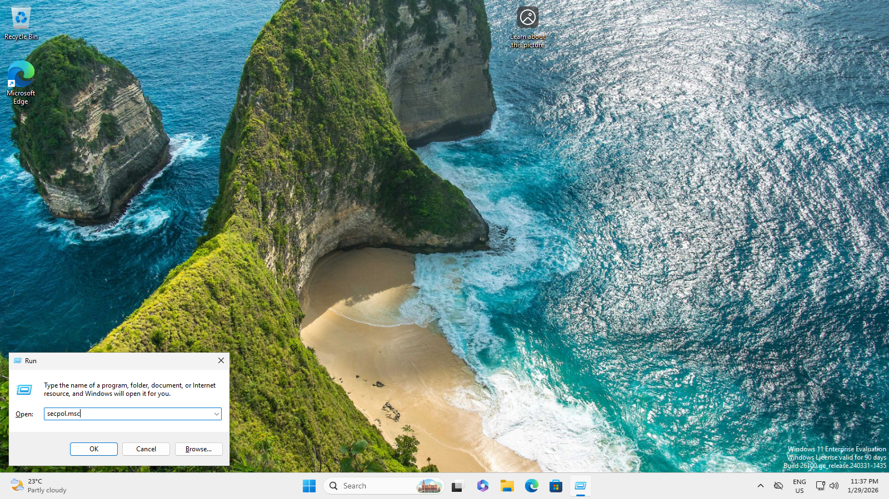
- Opened the Local Security Policy console using secpol.msc.

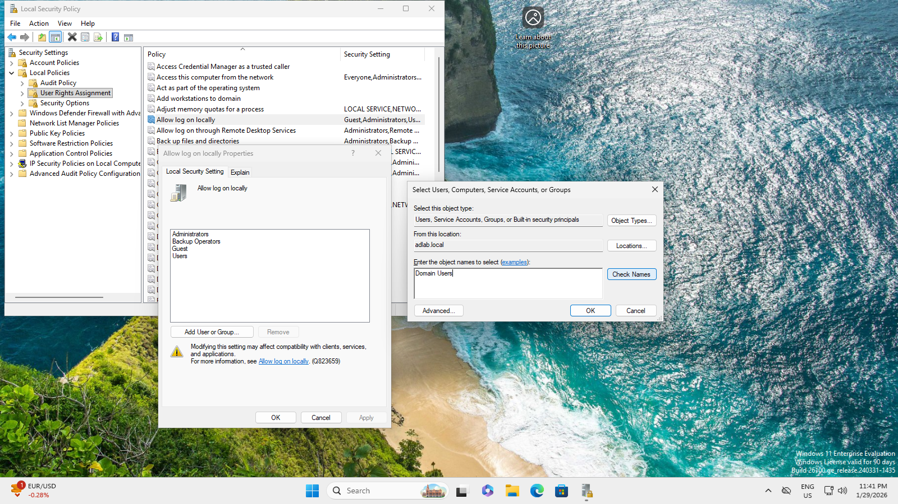
- Added the Domain users group in the **Allow Log on locally** policy.

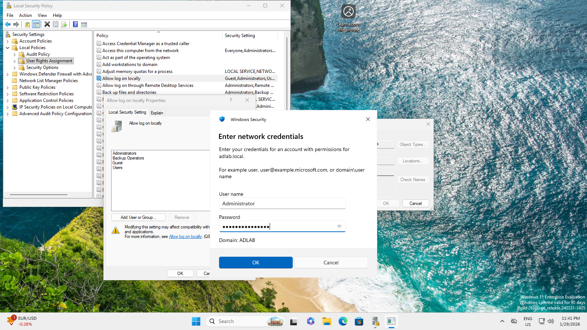
- Entered domain administrator credentials to apply the change.

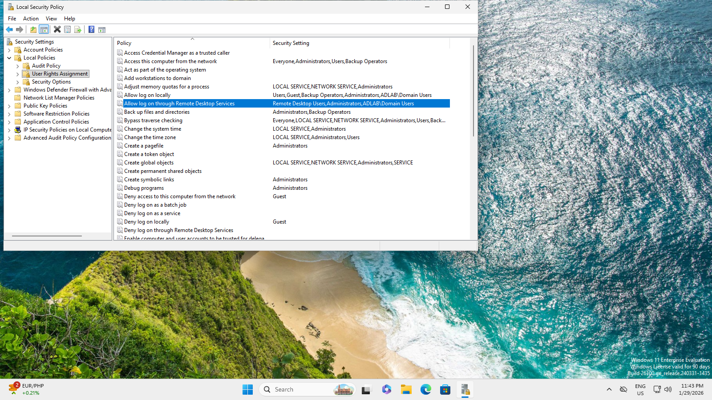
- Also added the same group in **Allow log on through Remote Desktop Services** policy.

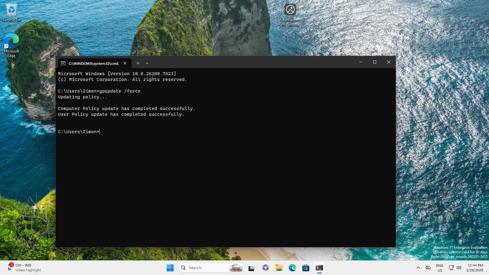
- Applied the changes by typing the command **gpupdate /force** in the command line then restart.

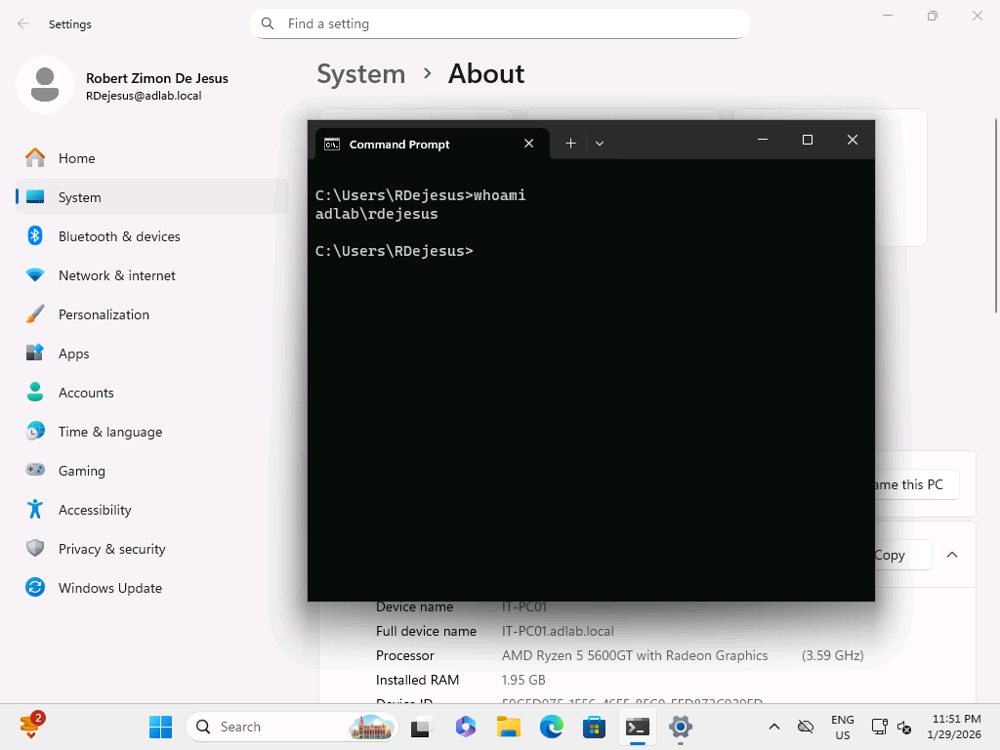
- Logged-in again using the Domain user account and it worked.

### ⚠️Note: This local configuration was applied only for troubleshooting. In later steps, logon rights will be centrally managed using Group Policy and security groups to follow enterprise best practices.
---

## 📚 What I Learned
