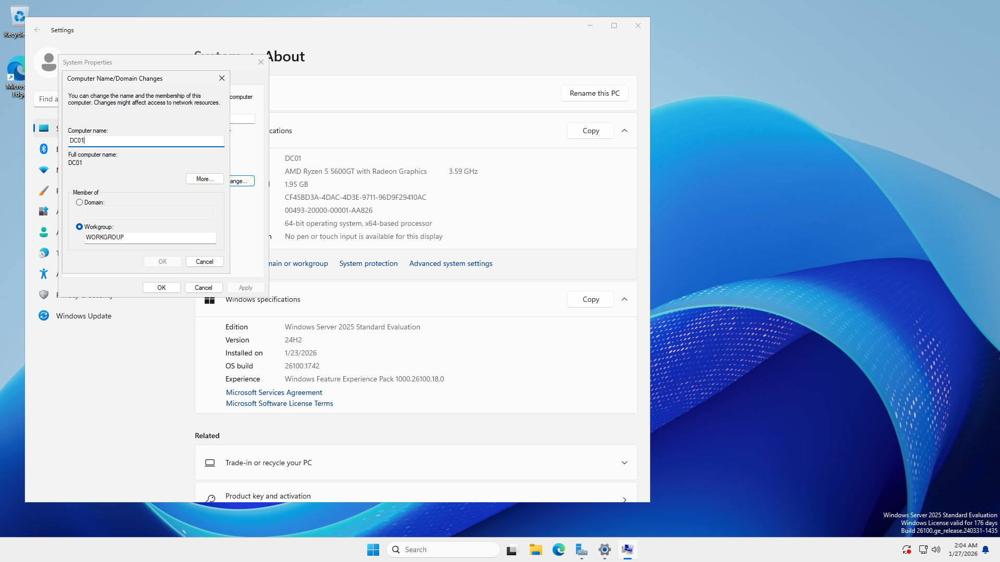

# Project Title: Active Directory Homelab hands-on practice

## 📌 Objective
Build a virtualized Windows Domain Environment to practice the fundamentals of System administration and cybersecurity.

---

## 🖥️ Environment
- Windows Server 2025 (Domain Controller)
- Windows 11 (Client Computer)
- Hyper-V
- Active Directory, Group Policy
  
---

## 🏗️ Lab Architecture

---

## ⚙️ Implementation Summary
- Installed and Configure both Virtual Machine for Client(Windows 11) and Server(Windows Server 2025)
- Promote Server to Domain Controller
- Create Organizational units and Users
- Joined a Client PC into Domain
- Applied Group Policies
---

## 📸 Screenshots and Steps
Below are the documented screenshots of Active Directory, Configurations, Security Practices. Each of these images are explained and also labeled for clarity.
### Step:1 Hyper-V and Virtual Machines Setup

- Set up the lab environment by creating two virtual machines (Server and Client).
- Allocated the systen resources and ready both of the virtual machine for installation.
  

- Configured an external virtual switch in Hyper-V that will connect both VMs into the same network.

- Ensured that both VMs are connected into the same switch for a proper communication between server and client.
---
### Step:2 Windows Server and Client installation

- Set a strong password for local Administrator.

- Installed Windows Server 2025 on the server VM.

- Renamed the server into DC01 for better identification.
---

## 📚 What I Learned
