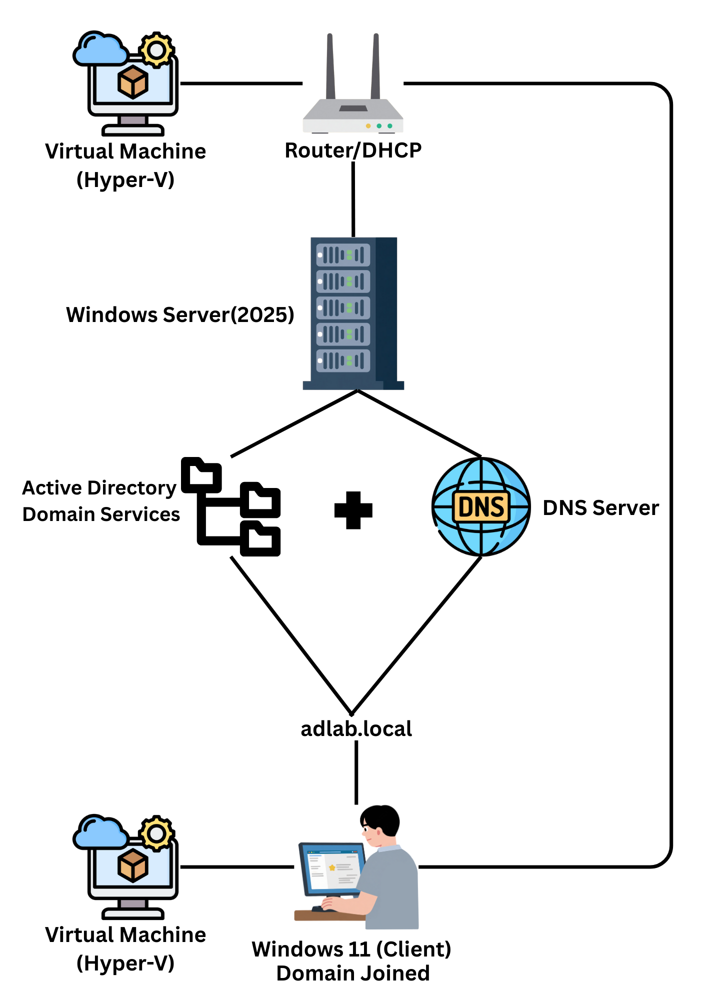

⬅️ [Previous: Introduction](01-introduction.md) | [Next: Installation ➡️](03-installation.md)

# 🏗️ Lab Architecture

## Lab Architecure Overview
This lab simulates a small enterprise virtual environment using Hyper-V. The setup includes a Windows server 2025 with a Active Directory Domain Services(Domain Controller) and a Windows 11 client both installed into the virtual machine which is the client domain joined worsktation and the server  is connected within the same virtual network switch to be able to connect these 2 devices and to be able to demonstrate a centralized management, user management and policy enforcement using the AD DS tool.

---

## Architecture Components

### Domain Controller
#### Operating System:
- Windows Server 2025
#### Roles Installed:
- Active Directory Domain Services (AD DS) 
- DNS Server
#### Functions: 
- User and group management
- Group Policy management
#### Domain Name:
- adlab.local
#### IP Configuration:
- Static IP
---

### Client Workstation
#### Operating System:
- Windows 11
#### Role:
- Domain-joined client computer
- Used to test domain user logon and Group Policy application
- IP Configuration: DHCP (Router)
- DNS Configuration: Points to Domain Controller IP
---

### Virtualization Platform
#### Hypervisor:
- Hyper-V
#### Virtual Machines:
- Windows Server 2025 (Domain Controller)
- Windows 11 (Client)
#### Network Type: 
- External Virtual Switch
---

⬅️ [Previous: Introduction](01-introduction.md) | [Next: Installation ➡️](03-installation.md)

