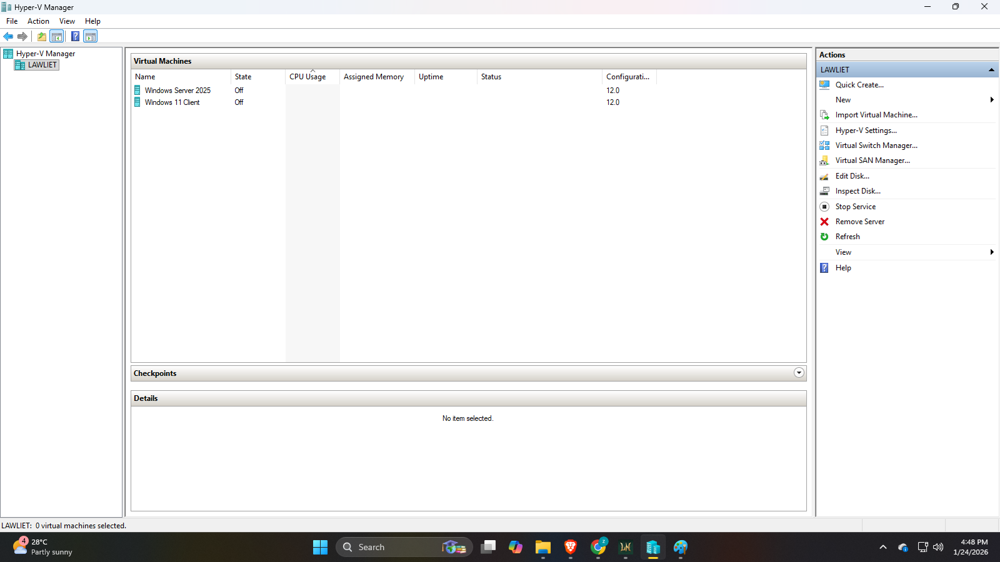
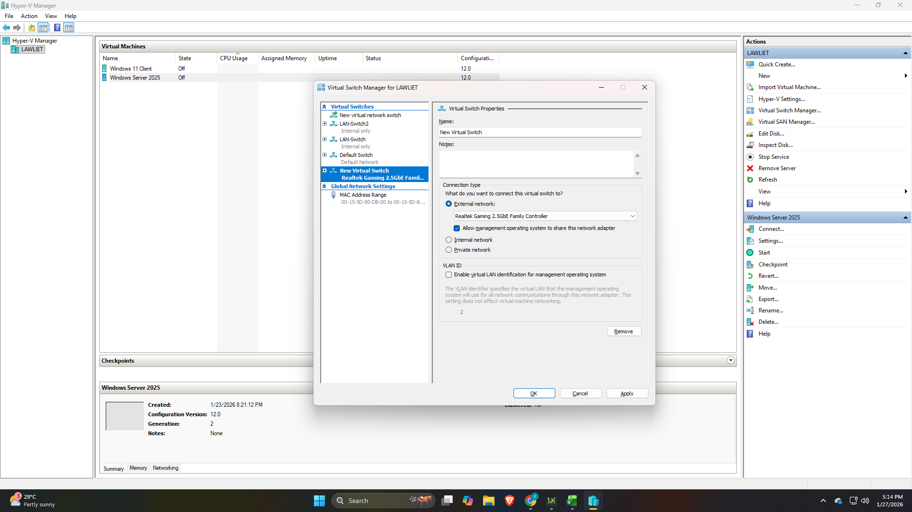
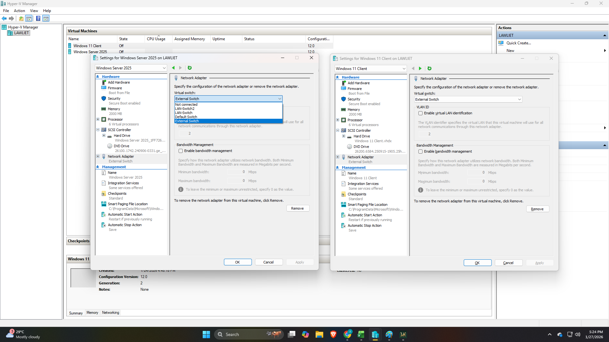
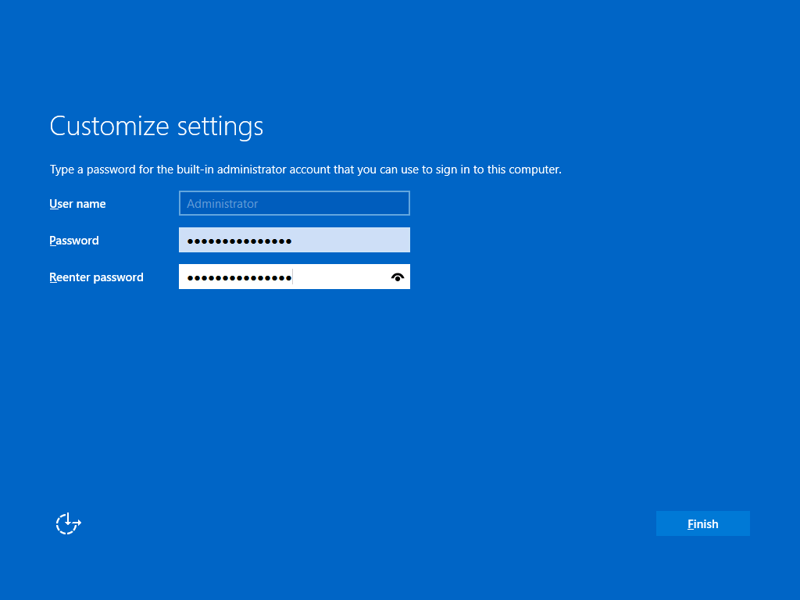
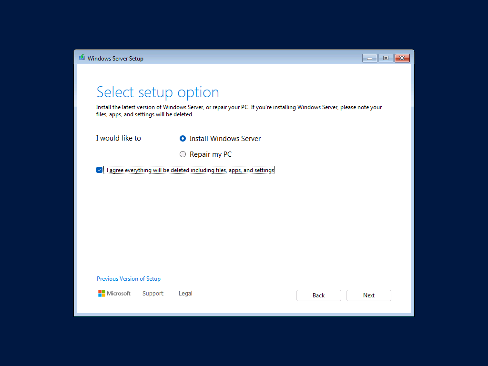
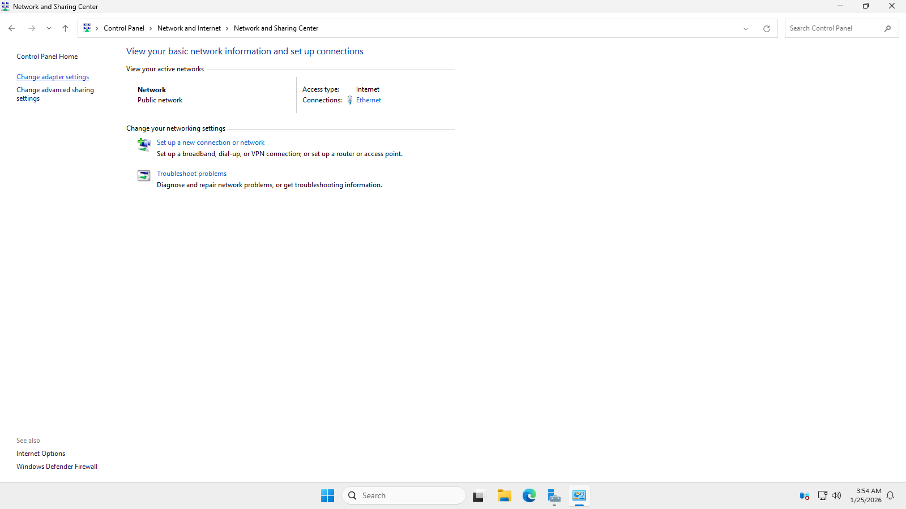
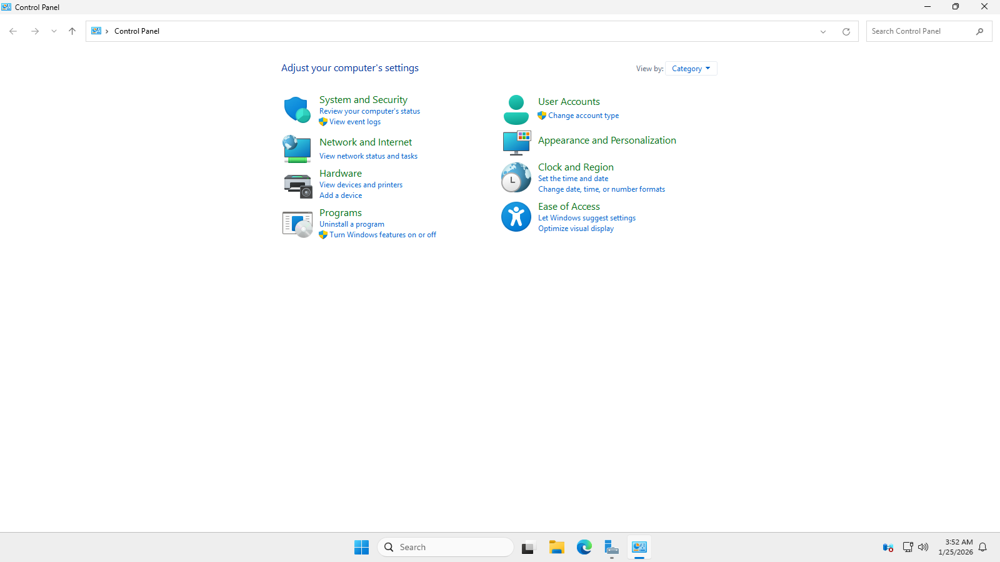
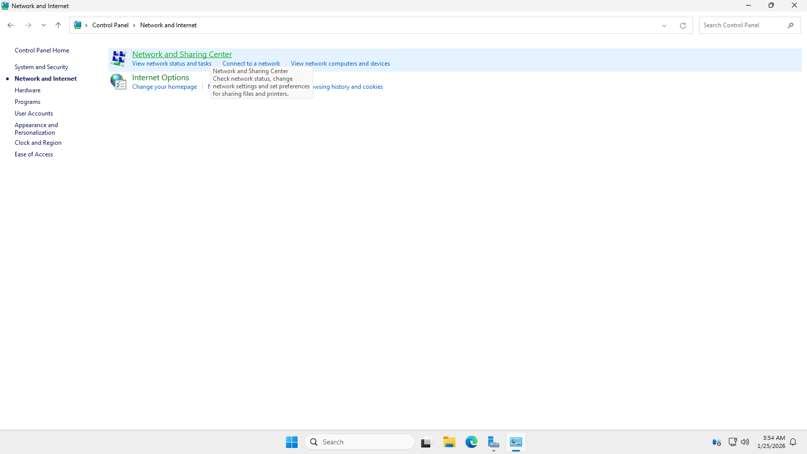

# ⚙️ Installation and Initial Setup

### Step:1 Hyper-V and Virtual Machines Setup

- Set up the lab environment by creating two virtual machines (Server and Client).
- Allocated the systen resources and ready both of the virtual machine for installation.
  

- Configured an external virtual switch in Hyper-V that will connect both VMs into the same network.

- Ensured that both VMs are connected into the same switch for a proper communication between server and client.
---
### Step:2 Windows Server installation and configuration

- Set a strong password for local Administrator.

- Installed Windows Server 2025 on the server VM.

- Renamed the server into DC01 for better identification.

- Configured a static IP address on the Windows Server to ensure stable network identity.
- Temporarily assigned the router’s DNS server so the system could access the internet for updates and feature installation.

- Verified connectivity before installing Active Directory Domain Services.

---
⬅️ [Previous: Lab Architecture](02-lab-architecture.md) | [Next: Active Directory Installation and Configuration ➡️](04-ad-installation-configuration.md)
---