⬅️ [Previous: Installation](03-installation.md) | [Next: Client Domain join ➡️](05-client-domain-join.md)

# 🧩 Active Directory Configuration

### Step:3 Installing Active Directory Domain Services
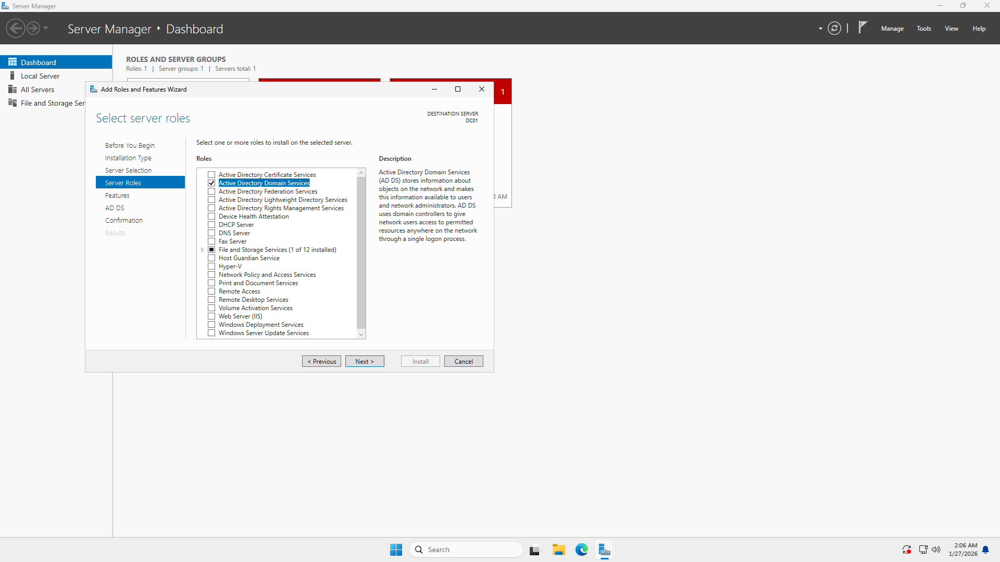
- Selected the role Active Directory Domain Services.

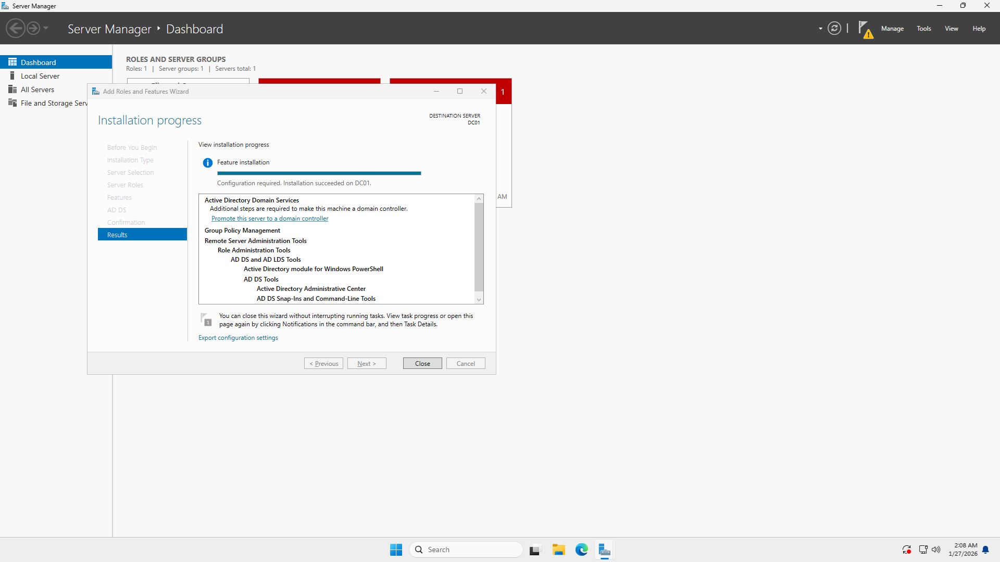
- Successfully installed ADDS into the server.

### Step:3.1 Promoting the server to Domain Controller

- Promoted the server to a Domain Controller and created a new forest named **adlab.local**.

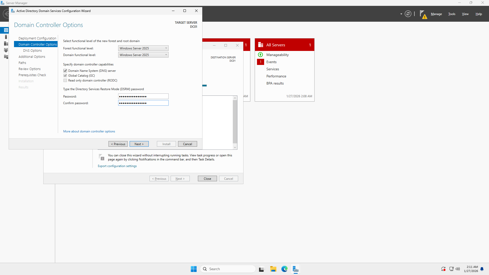
- Configured the server to install and integrate DNS services with Active Directory.

- Set the domain and NetBIOS name for the Active Directory environment.

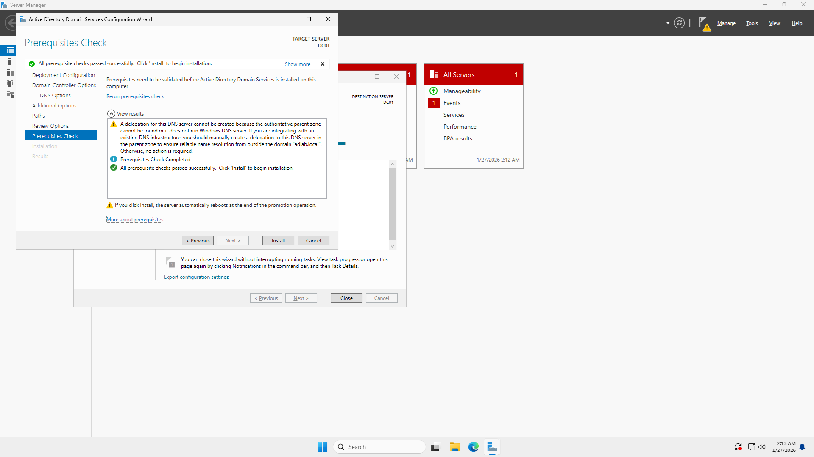
- Completed the prerequisites check and verified system readiness before finalizing the promotion.
- The DNS delegation warning appeared because this is a new forest with no existing parent DNS zone. This is expected behavior and does not affect functionality.

### Step 3.2: Post-Installation Verification and DNS Reconfiguration
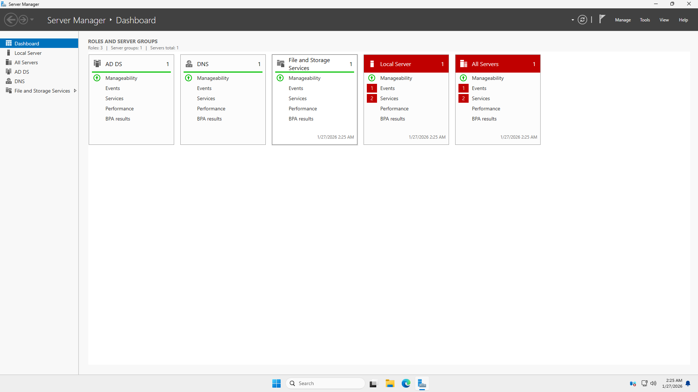
- Verified successful installation and promotion of the server by confirming that Active Directory Domain Services and DNS are both running with healthy status in Server Manager.

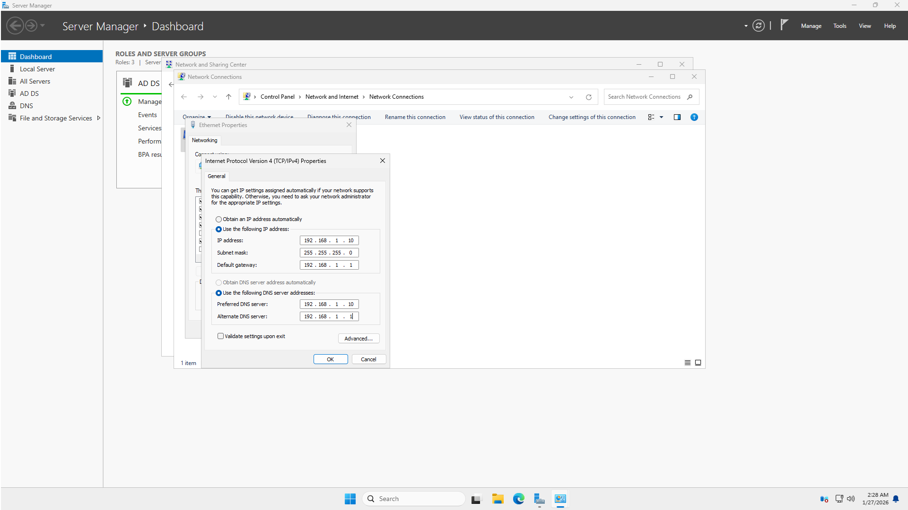
- Reconfigured the server’s DNS settings to point to its own IP address.
- This ensures the Domain Controller uses itself as the primary DNS server, which is required for proper Active Directory functionality and domain name resolution.

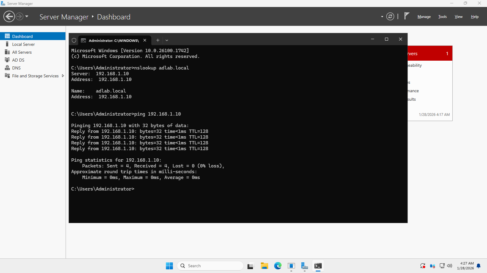
- Tested DNS functionality by resolving the domain name to confirm proper name resolution.

### Step 3.3: Creating Organizational Units (OUs) separated by Department
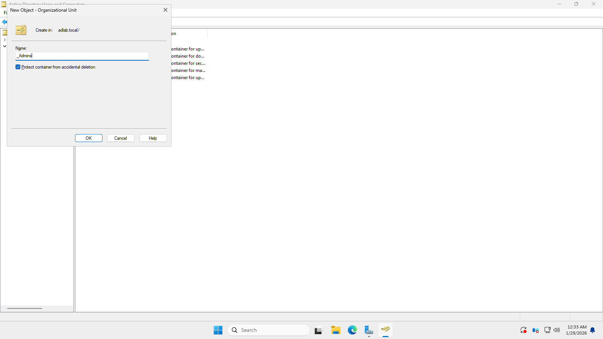
- Created an OU for Admins it separated from the other departments.
- Admins OU is separate for privileged accounts.
- Checked the **"Protect from accidental deletion"** to prevent it from deleting accidentally.

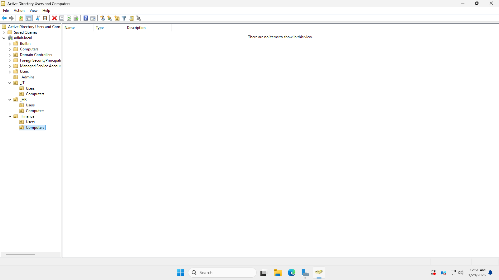
- Created each departments OUs: HR, IT, and Finance.
- Each department contains Users and Computers sub-OUs for better organization and security management.

### Step 3.4: Creating User for the User OU
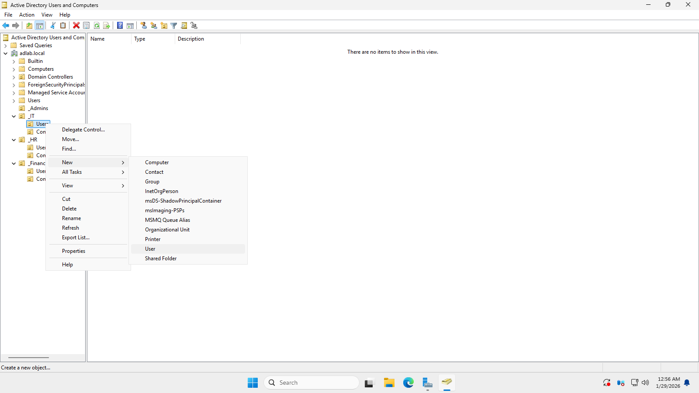
- Create a User for the IT Department.

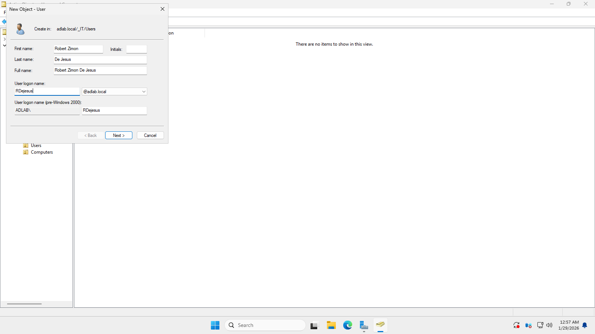
- Filled up the users information for their user account.

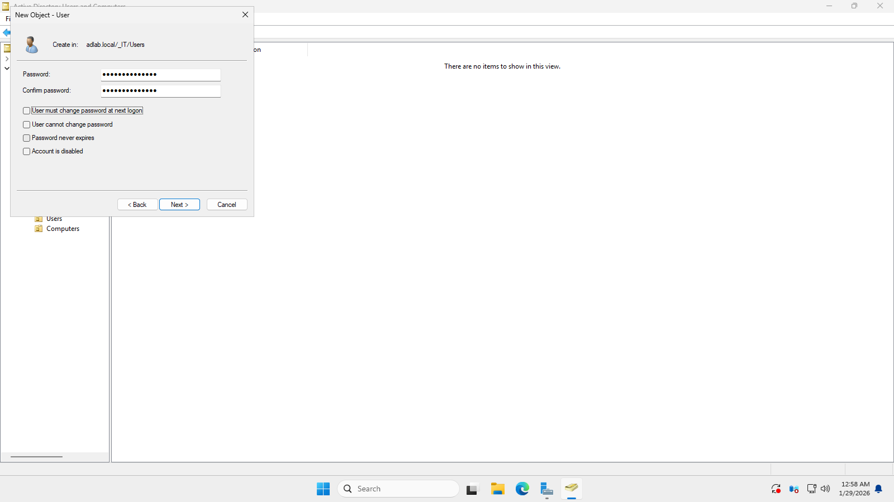
- Created a strong password for the User.
- Temporarily disabled **"User must change password at next logon"** for lab purposes(It's not recommended).

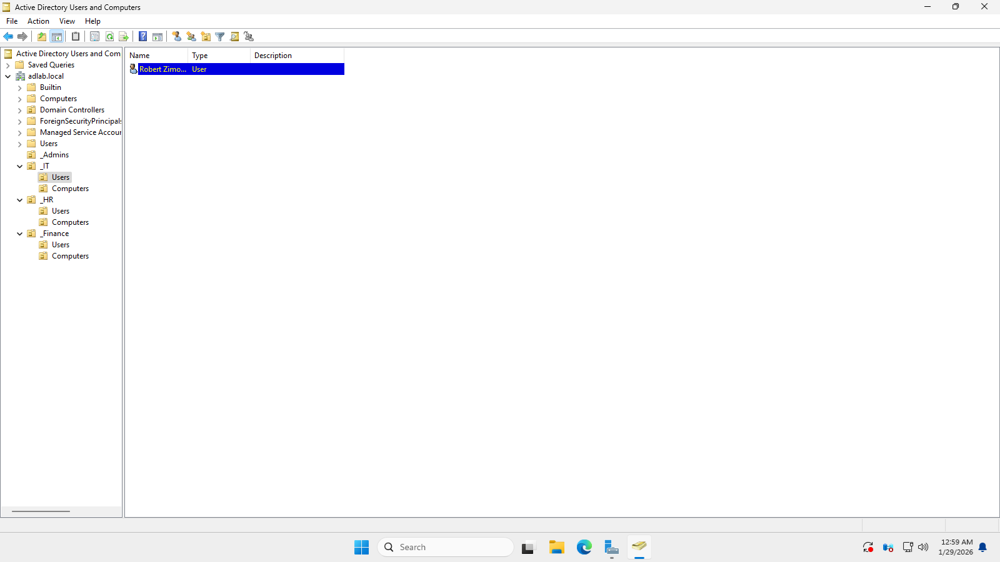
- This image shows that the user is successfully created.

⬅️ [Previous: Installation](03-installation.md) | [Next: Client Domain join ➡️](05-client-domain-join.md)
