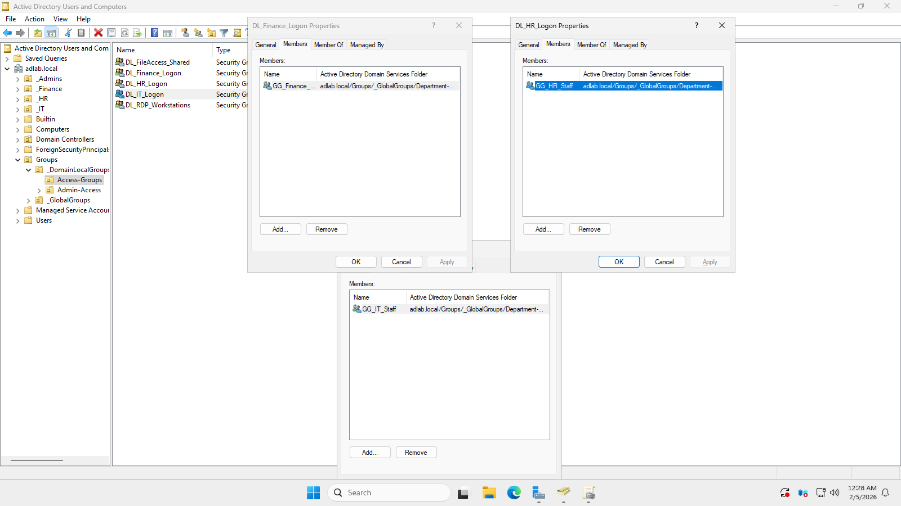
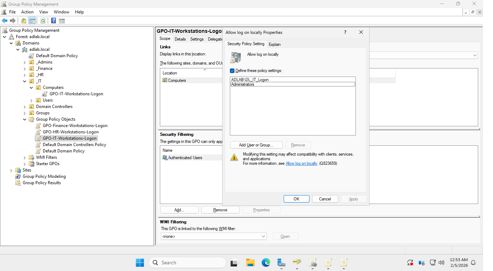
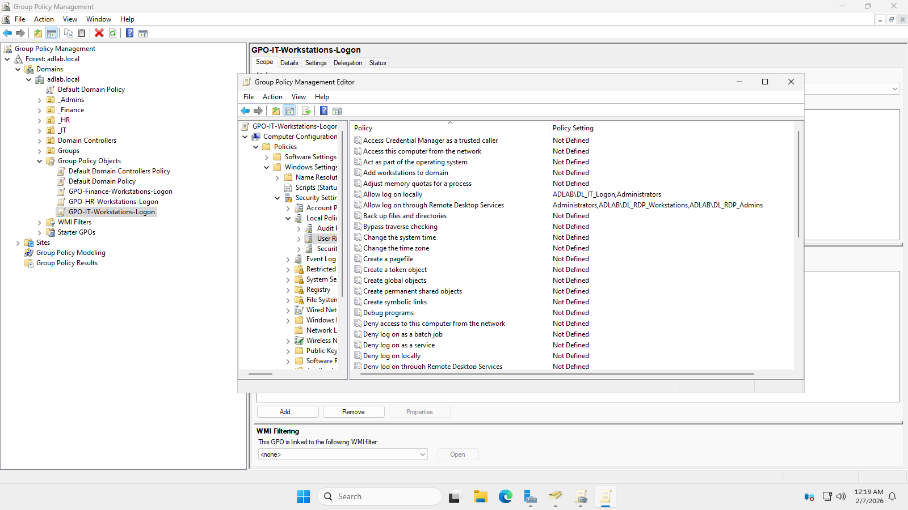
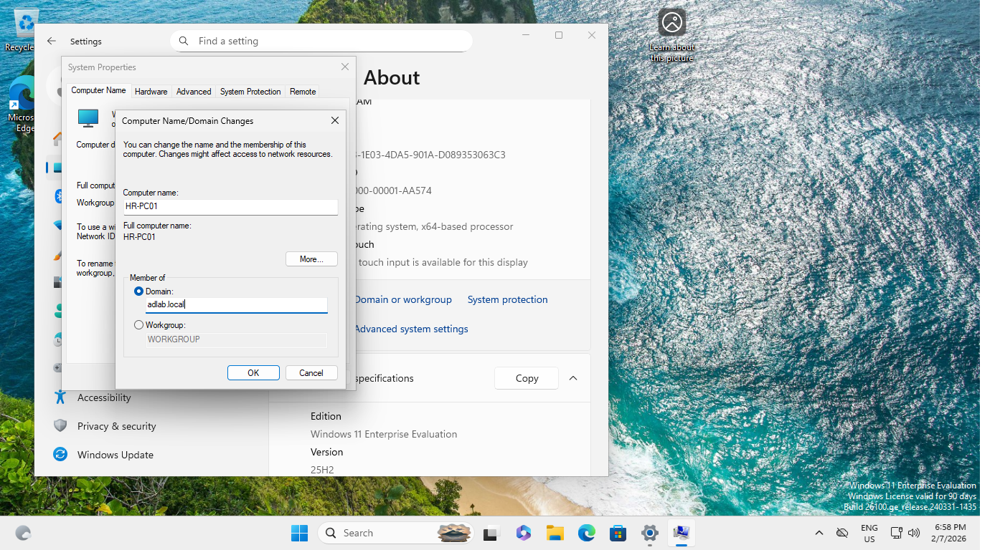
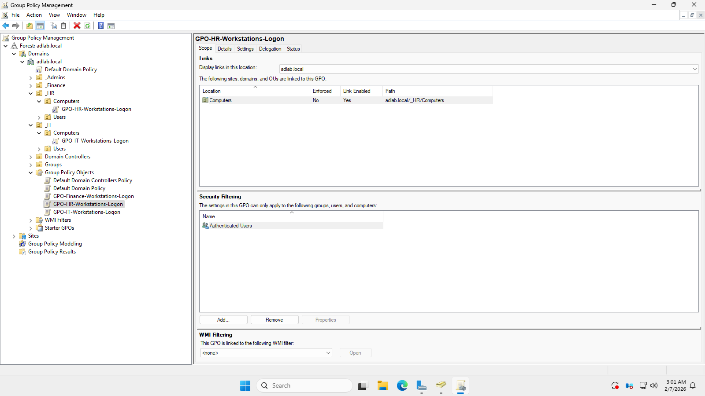
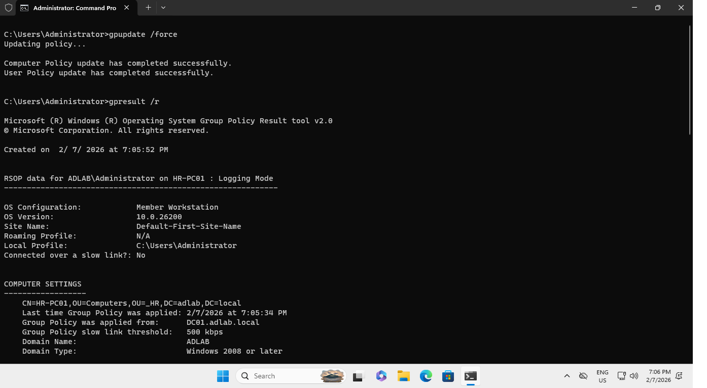
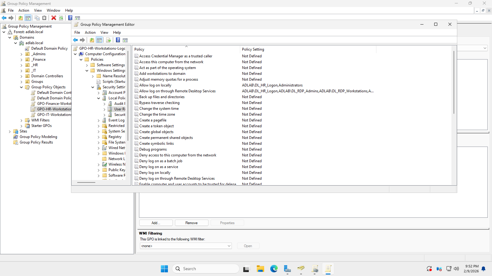
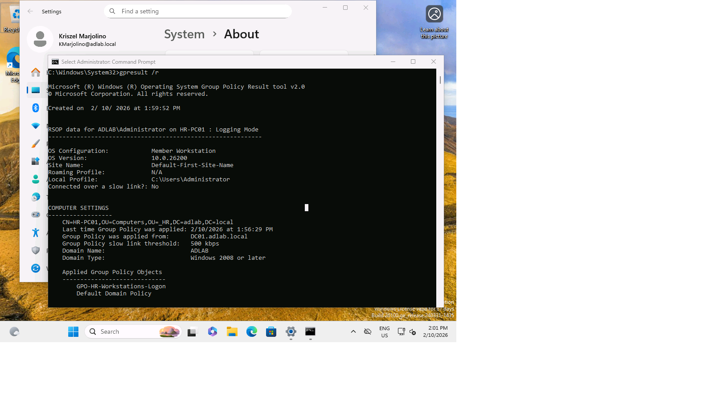

⬅️ [Previous: Groups and GPO](06-groups-and-gpo.md) | [Next: Lessons Learned➡️](08-lessons-learned.md)

# Step 6: 🛠️ Testing and Troubleshooting

### Step 6.1: Test Domain user logon

- Attempted to log in using the domain user created in Step 3 [Active Directory Installation and configuration](04-ad-installation-configuration.md).
- Logged in using an IT department domain user account.
- The target machine was IT workstation.

### Step 6.2: Issue Encountered: Remote Desktop Service Logon Error

- Login attempt failed with a Remote Desktop Services–related error, even though the user was logging in locally.
#### Problem Cause
- Domain users was not included in allow logon policy and Remote Desktop services.
- Allow logon policy on a freshly installed server may not automatically enabled.
#### Why this happens?
- Fresh installation of server may not automatically include domain users logon rights

### Step 6.3: Troubleshooting and Temporarily fixed the Domain logon issue

- To fix the issue I logged-in in the client using Local Administrator to perform troubleshooting.

- Opened the Local Security Policy console using secpol.msc.

- Added the Domain users group in the **Allow Log on locally** policy.

- Entered domain administrator credentials to apply the change.

- Added the Domain users group in **Allow log on through Remote Desktop Services** policy.

### Step 6.4: Validation and policy application

- Applied the changes by typing the command **gpupdate /force** in the command line then restart the machine.

- Successfully Logged-in using the Domain user account.
- The issue is now confirmed solve.

### ⚠️Note: This local configuration was applied only for troubleshooting. In the last steps [Groups and GPO](06-groups-and-gpo.md), logon rights was centrally managed using Group Policy and security groups to follow enterprise best practices this step is how do permanently fix the issue and the most efficient way to solve the problem. 

---
# Step 7: 🛠️ Testing and Troubleshooting 2

### Step 7.1: Restructure Domain Local Access Group OUs

- Realized that the previous Domain local security groups in Access group OU that handles user logon rights was not enforced the RBAC and just include of the Global security groups inside of this OU.
- To fix the issue I restructure the Access Group OU and separate the Domain local security groups that handles logon rights into department based.

### Step 7.2: Restructure GPOs of each department Global security groups

- Restructure the GPO that will handle the permission Allow logon rights of each department.

- Added the Domain local security groups in each corresponding GPO.

### Step 7.3: Add new workstation for HR user for testing.

- Added a new Workstation for hr and join it into the domain.

### Step 7.4: Link the GPO HR logon rights into its corresponding department.

- Moved the new domained joined computer into the HR workstation.
- Successfully linked the GPO Hr logon rights into the HR workstation. 

- In the HR workstation, Logged in as a Domain Administrator and apply the changes by typing the command gpupdate /force

### Step 7.5: Issue encountered 2: Remote Desktop Service Logon in HR workstation

- The same problem occur from the IT workstation in the previous step in HR workstation.
- In this step I realized that using a VMs when logging-in in a domain using domained join devices even though they have the same virtual switch, The VM will consider it as a Remote Desktop Access so when I tried to logged-in using a domain user it prompted me an RDP error.
- To fix the issue I also included the RDP rights in GPO of HR Domain Local groups.
- Note that in a real environment where devices is connected physically I don't need to configure logon rights in this lab I only do it for troubleshooting, practising applying GPOs and To be able to Test the connections of my lab devices. Also note that RDP rights must only configured carefully, in this lab I only add the RDP rights into HR GPO to be able login, its not recommended in real environment because devices where connected physically so even though RDP is disabled, domain users that has the logon rights will be able to log in their accounts.

- Successfully logged-in as HR user in HR workstation.

- Open CMD as administrator and verified the GPO in the HR workstation if applied correctly.
⬅️ [Previous: Groups and GPO](06-groups-and-gpo.md) | [Next: Lessons Learned➡️](08-lessons-learned.md)