⬅️ [Previous: Lessons Learned](08-lessons-learned.md)
# 📚 Additional and Validation
### Disabling Control Panel with Security Filtering
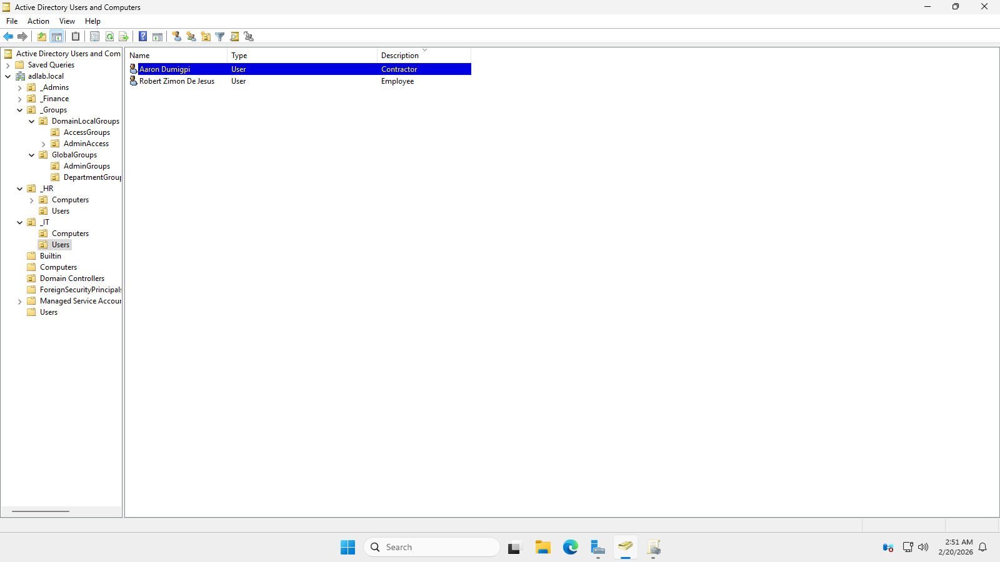
- Added a new IT user

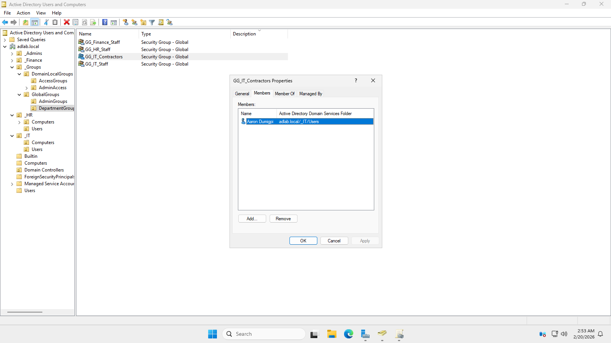
- Make another Group that will contain the IT user contractor.
- Note there's two different role in IT users the Employee and the contractor.

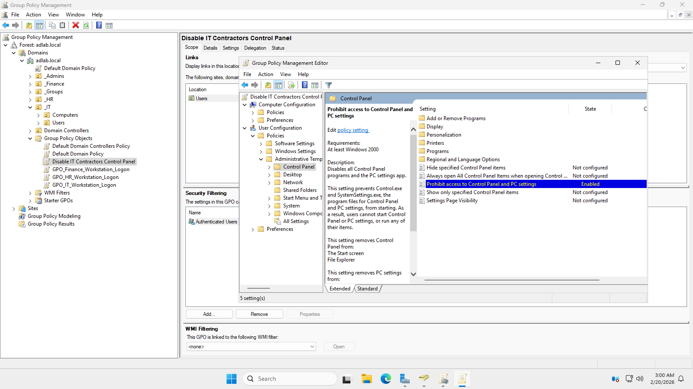
- Added and configured a new GPO that will restrict the Control panel of the IT Contractors.
- This is a user configuration, navigated to User Configuration>Administrative Templates>Control Panel> then enable the Prohibit the access to Control panel and settings and link the GPO into the IT users OU.

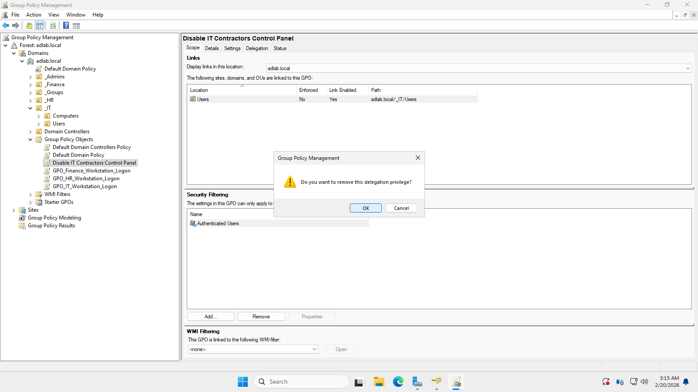
- Remove the Authenticated Users from the security filtering to specify the user or group that will use the GPO.

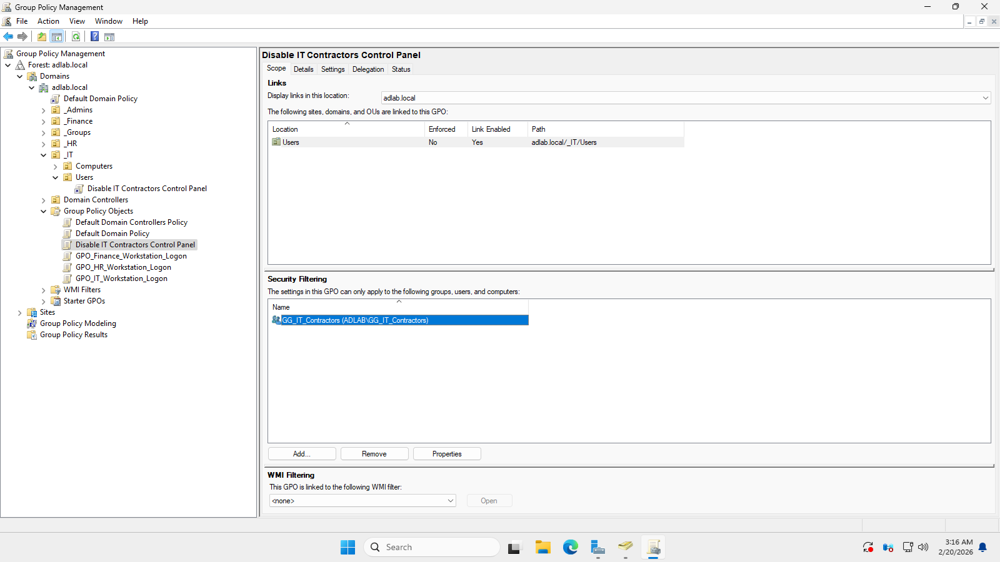
- Add the group that will use the Disable Control Panel GPO which is the GG_IT_Contractor.

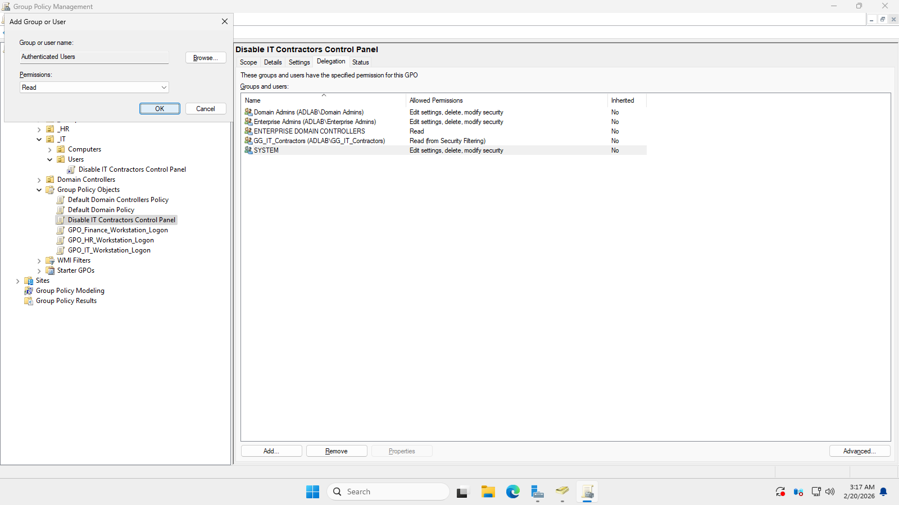
- Navigated into the delagation tab and add the Authenticated users, make sure that the permission is in the read only and the apply gpo is also disabled for other users that is not included in the group to still be able to access the control panel.

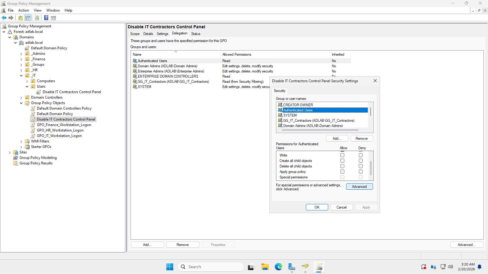
- Verified the permission of the Authenticated Users.

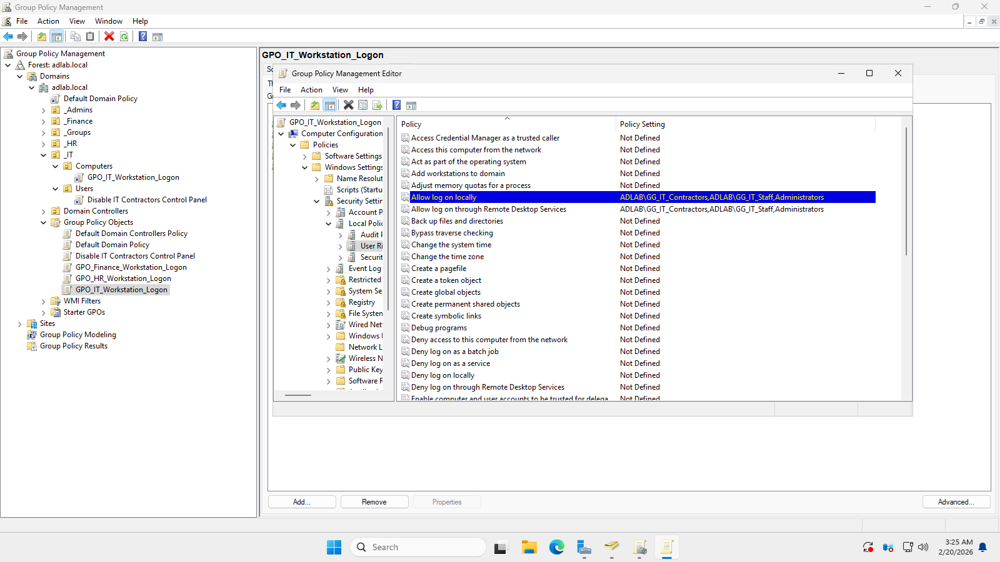
- Added the same Group into the IT GPO logon rights for the group to be able to logged in into the workstation.
- Note they have the same workstation but the IT contractor group has more restrictions.

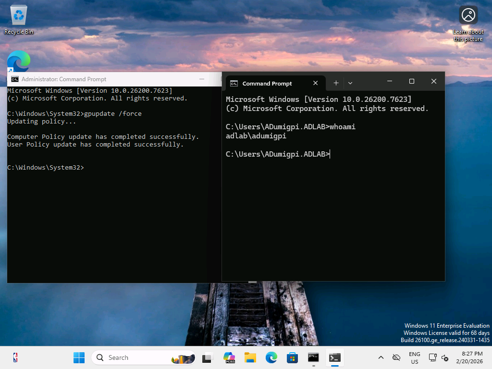
- Logged-in using the IT contractor's account and open CMD as administrator to apply the policy.

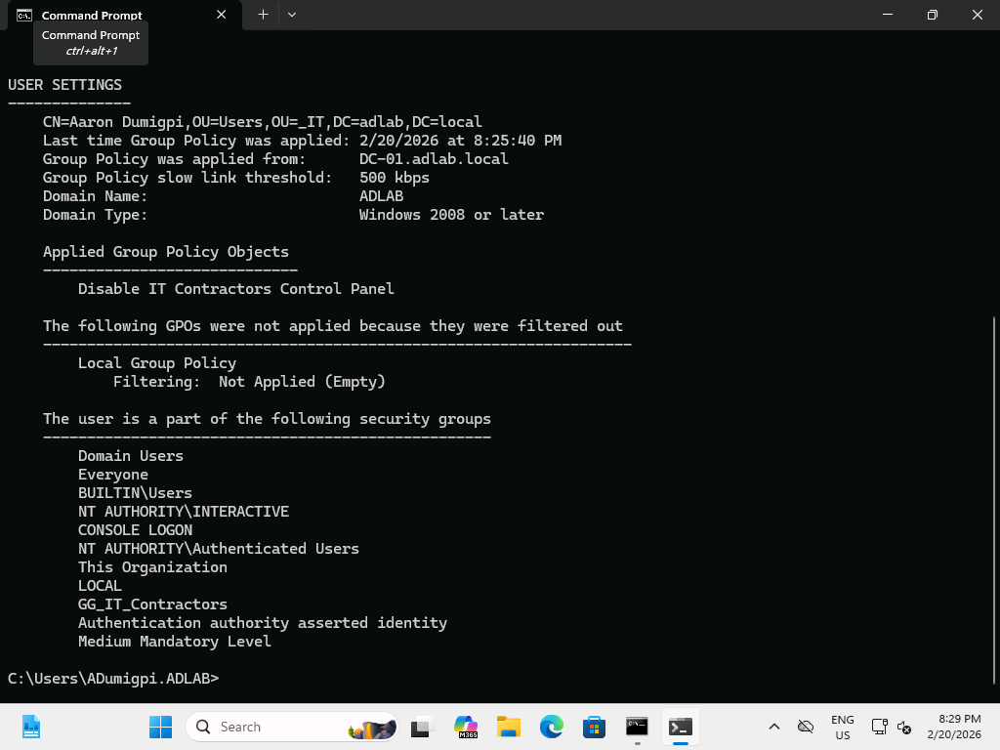
- Verified that the policy is already updated.

### Validation
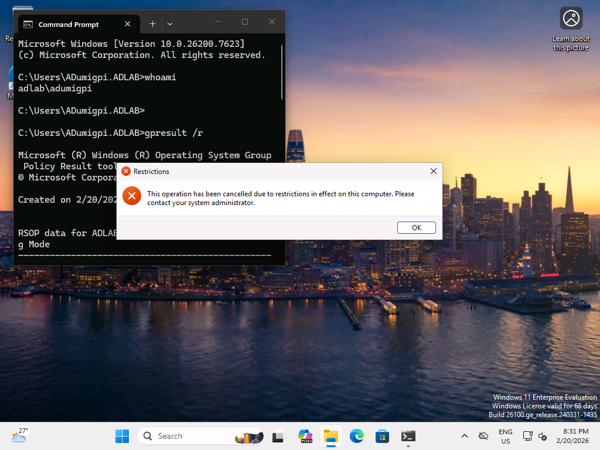
- In the IT workstation, Logged-in as the IT Contractor and verified that the GPO is working.

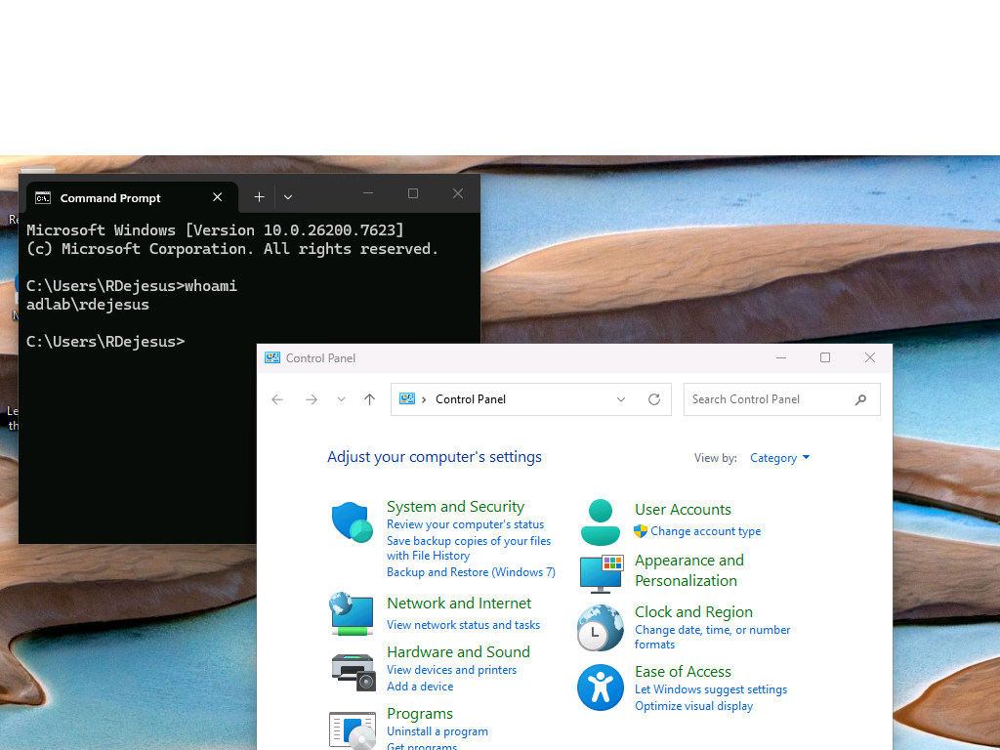
- In the IT workstation, Logged-in as the IT Employee and verified that the GPO security filtering is working properly and the control panel of this group is still working.

### Password Reset
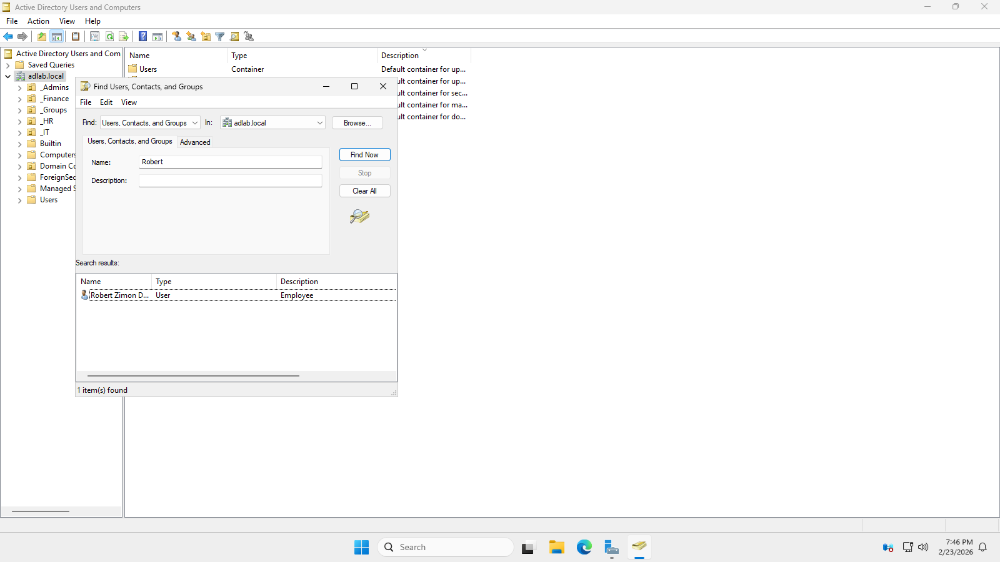
- Search the user that will reset the password.

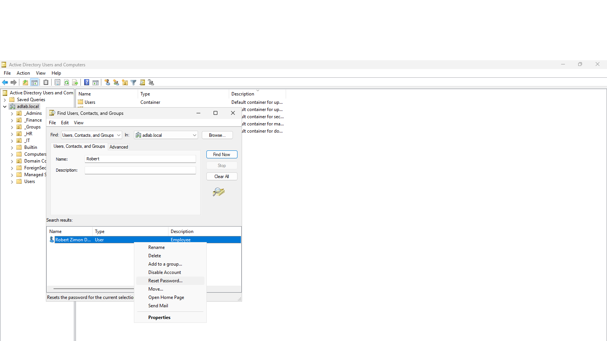
- Click the Reset password in the options.

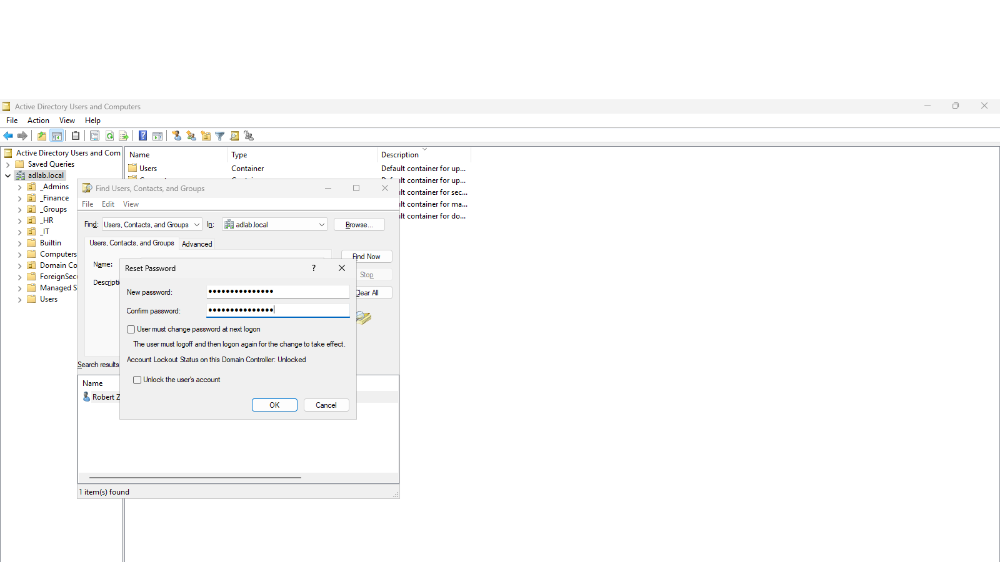
- Use a strong password for the user.

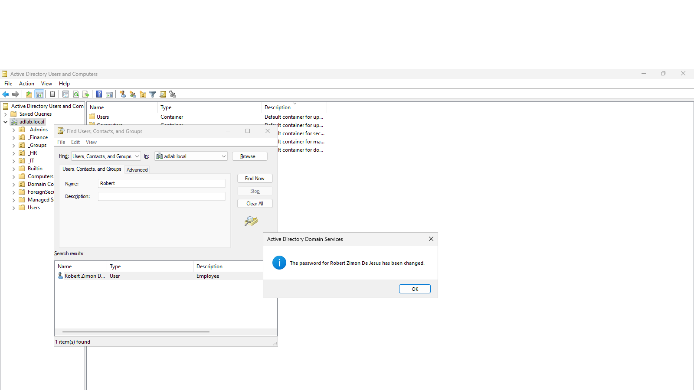
- The user password was successfully changed.

### RBAC Validation
#### Validation in the HR workstation

- Logged-in in the HR workstation using the IT user credentials.

- The logged-in failed due to the restriction of the GPO that is added in the HR workstation.
- Only HR user will be able to logged-in in the HR workstation.

#### Validation in the IT workstation

- Logged-in in the IT workstation using the HR user credentials.

- The logged-in failed and also show the same error in the HR workstation thats because of the restriction that has been added into the GPO IT workstation.
- Only IT users will be able to logged-in in the IT workstation.
⬅️ [Previous: Lessons Learned](08-lessons-learned.md)